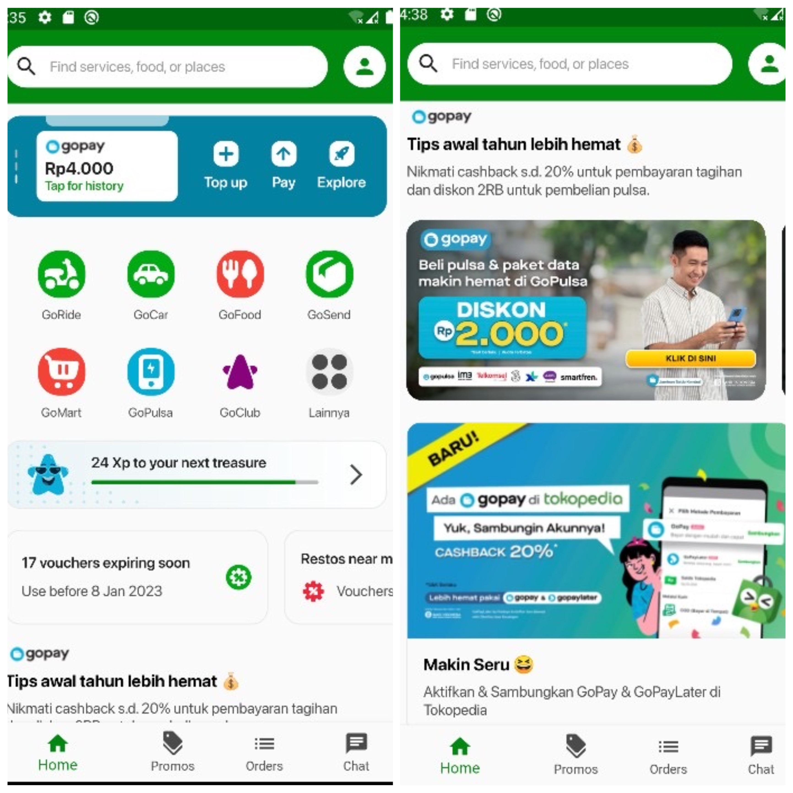
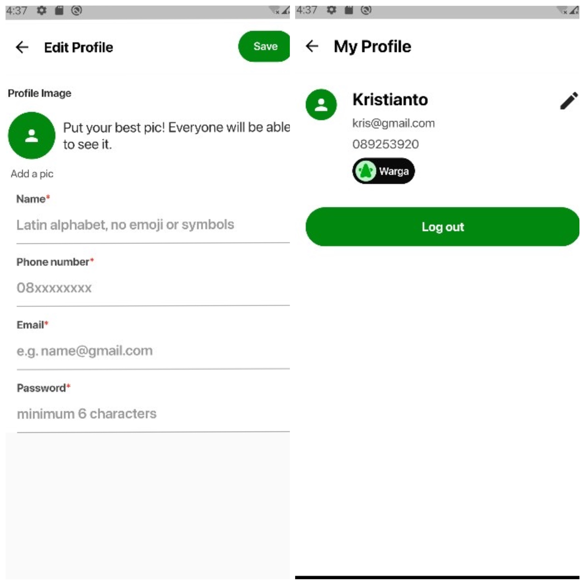
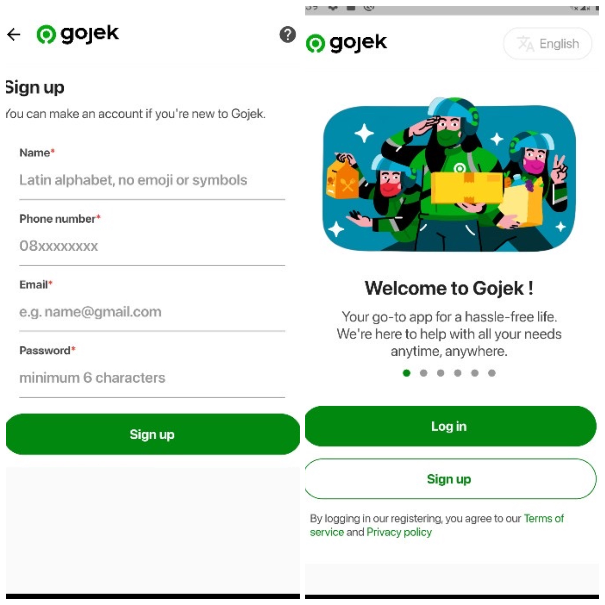

# Gojek Cloning App

Built with flutter by implementing real gojek UI and components that can support direct interaction with users. This application also supports middleware and authentication with encrypted JWT token on local storage, as well as form validation using regex.

## Setup Project

    $ git clone https://github.com/YOUR_USERNAME/PROJECT_TITLE
    $ cd PROJECT_TITLE

## Install Dependencies

    $ flutter pub get

## Run the project
    $ flutter run

## UI Screenshots

